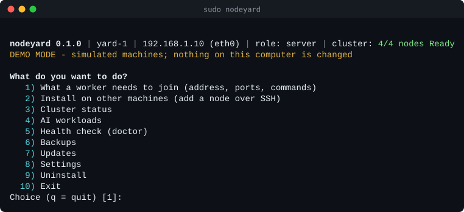
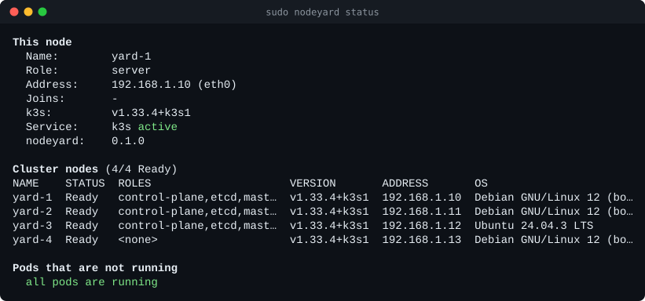
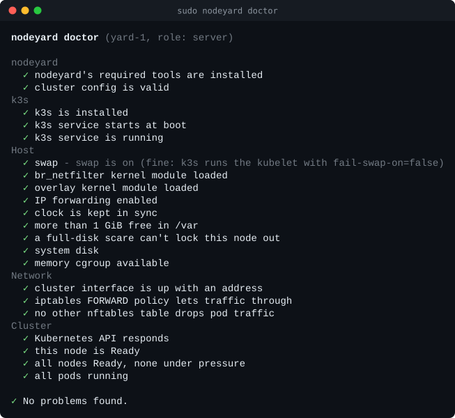
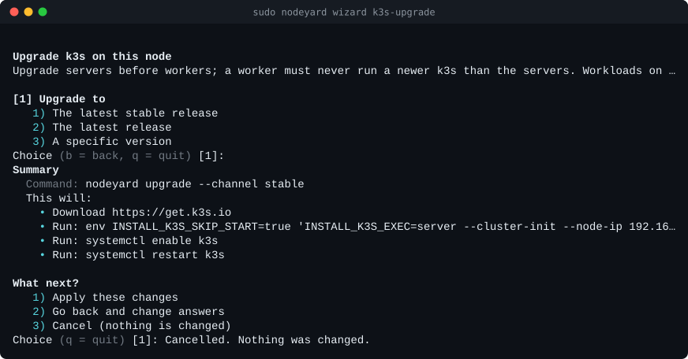
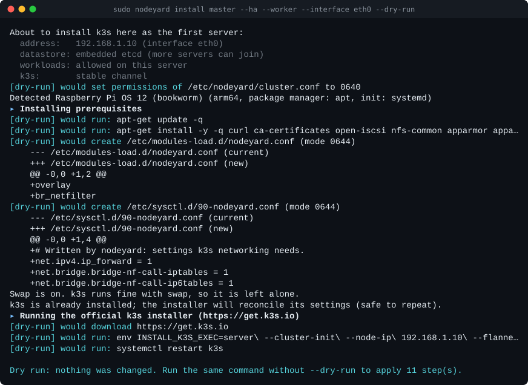

# nodeyard

[](https://github.com/Codemanhtmlpythoncss/nodeyard/actions/workflows/ci.yml)
[](https://github.com/Codemanhtmlpythoncss/nodeyard/releases)
[](LICENSE)

**Set up and run a homelab cluster of Linux machines from one command.**
Raspberry Pis, mini PCs and old laptops on one switch become a
[k3s](https://k3s.io) Kubernetes cluster you can manage from a guided
terminal menu or the command line, with AI models, health checks, and an
undo for every change it makes.



> **Status: early development.** 0.1.0 is the foundation release: the k3s
> cluster, AI and operations features below work today. Static IPs and a
> network device view, a remote installer for your laptop, a floating
> virtual IP, web dashboards, website hosting and more are on the
> [roadmap](docs/STATUS.md). nodeyard is the successor to
> `k3s-manager`; every k3s-manager command still works.

## Features

**Today (0.1.0)**

- **Guided menu and wizards**: a status line with this machine's role and
  the cluster's health, a first-run quick-start that detects your hardware
  and recommends a setup, and wizards that show exactly what will change
  before anything does. Works with gum, whiptail, dialog or plain prompts,
  so it's fine over any SSH session.
- **k3s clusters**: first server, extra servers (embedded etcd for high
  availability) and workers, with the fixes homelab machines need
  (Raspberry Pi cgroups, kernel modules, firewalls that silently drop pod
  traffic, port clashes with Nextcloud/Docker, disk-pressure lockouts).
  Add machines over SSH with verified host keys.
- **Undo for everything**: every system file is backed up before it's
  changed. `nodeyard changes` shows what was done; `nodeyard undo` puts
  it back.
- **`--dry-run` on every command**, showing each file diff and command.
  `--json` output for scripting.
- **`doctor`** finds common problems and fixes them one at a time.
- **AI workloads**: Ollama on one node or across the cluster, model
  management on every node at once, and (experimental) one large model
  split across several machines.
- **A web dashboard** on `localhost:9092` (through an SSH tunnel): total
  resources and usage over time, every node's IP address and load, pods
  with live usage and logs, services and the addresses to reach them,
  storage, events, alerts and AI models. Read-only.
- **One config file** for the whole cluster, validated with clear errors,
  exportable and importable, with a drift check.
- **Safe with secrets**: tokens and passwords never appear in logs,
  output or command lines.
- **Demo mode**: try all of it against a simulated cluster, changing
  nothing.

**Coming next**: static IPs with automatic rollback and a view of every
device on your network (0.2), a remote installer you run from your laptop
(0.3), a floating virtual IP with automatic failover (0.4), web dashboards
and monitoring (0.5), website hosting with HTTPS (0.6), a single
OpenAI-compatible endpoint for all your AI nodes (0.7), backups, alerts
and power management (0.8). See the [roadmap](docs/STATUS.md).

| | |
|---|---|
|  |  |
|  |  |

## Requirements

- Linux machines with systemd on amd64 or arm64: Debian 12+, Ubuntu
  22.04/24.04/26.04 LTS, Raspberry Pi OS (64-bit), Fedora 42+,
  RHEL/Rocky/AlmaLinux 8+, Arch, openSUSE Leap 15.6+/Tumbleweed.
  [Details](docs/distros-and-hardware.md).
- bash 4.3+ (every supported distro has it), `sudo`, internet access.
- 2 GB+ RAM for a k3s server (an SSD rather than an SD card is
  recommended), 1 GB+ for a worker.

## Install

On each machine:

```bash
curl -fsSL https://raw.githubusercontent.com/Codemanhtmlpythoncss/nodeyard/main/install.sh | sudo bash
```

The installer verifies the release's SHA-256 checksum, installs to
`/usr/local/lib/nodeyard`, and offers to install the few packages nodeyard
needs. Running it again updates in place. To read it first:
`curl -fsSLO https://raw.githubusercontent.com/Codemanhtmlpythoncss/nodeyard/main/install.sh`,
then `sudo bash install.sh`.

## Quick start

```bash
sudo nodeyard                     # the guided menu (quick-start on first run)
```

Or by command:

```bash
nodeyard detect                                            # what nodeyard sees
sudo nodeyard install master --ha --worker --interface eth0 --dry-run   # look first
sudo nodeyard install master --ha --worker --interface eth0             # first server
sudo nodeyard add-node worker --ssh admin@192.168.1.11                  # join another machine
sudo nodeyard status                                       # the cluster at a glance
sudo nodeyard doctor                                       # check and fix
```

Try it without any hardware:

```bash
nodeyard --demo
```

Read [getting started](docs/getting-started.md) for the full walk-through.

## Documentation

- [Getting started](docs/getting-started.md)
- [The menu and wizards](docs/menu-and-wizards.md)
- [k3s clusters and nodes](docs/k3s.md)
- [AI workloads](docs/ai.md)
- [The web dashboard](docs/dashboard.md)
- [doctor](docs/doctor.md)
- [Snapshots and backups](docs/backups.md)
- [Changes and undo](docs/changes-and-undo.md)
- [The cluster config file](docs/configuration.md)
- [Command reference](docs/commands.md)
- [Demo mode](docs/demo-mode.md)
- [Supported distros and hardware](docs/distros-and-hardware.md)
- [Troubleshooting](docs/troubleshooting.md) and [FAQ](docs/faq.md)
- [Upgrading](docs/upgrading.md), including from k3s-manager
- [Security](docs/security.md)
- [Architecture](docs/architecture.md) and [development](docs/development.md)
- [Status and roadmap](docs/STATUS.md)

## Contributing

Bug reports, testing on hardware, docs and code are all welcome: see
[CONTRIBUTING.md](CONTRIBUTING.md). Please report security problems
privately as described in [SECURITY.md](SECURITY.md). Everyone taking part
is expected to follow the [code of conduct](CODE_OF_CONDUCT.md).

## License

[MIT](LICENSE)
